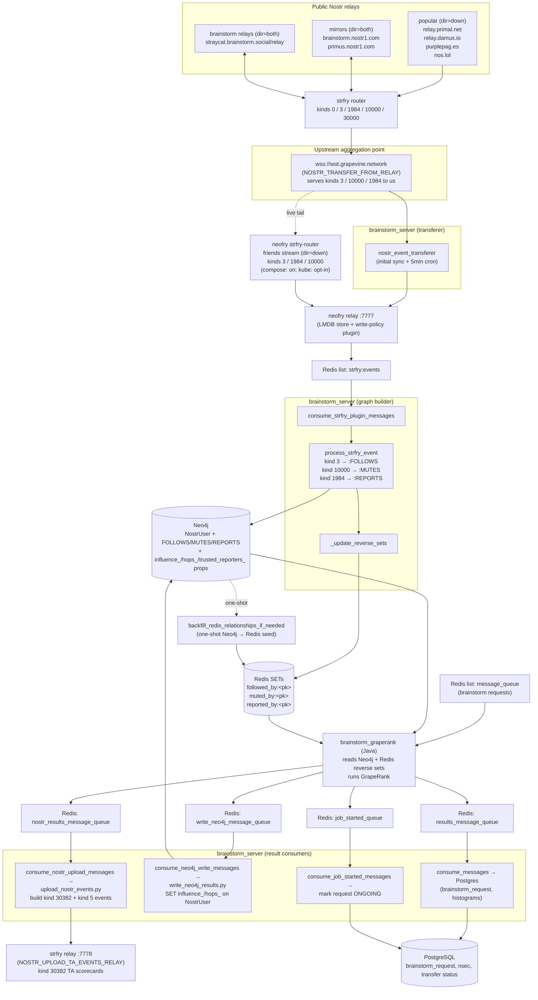

# Brainstorm ETL Pipeline

End-to-end flow of Nostr events from the upstream relay through Neo4j and back
out to the TA results relay. Derived from reading the source in
`brainstorm_server`, `brainstorm_graperank_algorithm`, and `neofry`.

## Stages

0. **Public relays → `wot.grapevine.network` (strfry router).** Out of band
   from this codebase, a `strfry router` running in front of
   `wot.grapevine.network` continuously streams WoT-relevant kinds
   (`0, 3, 1984, 10000, 30000`) from a set of upstream relays. Three groups:
   - **popular** (`dir = down`, fetch only): `wss://relay.primal.net`,
     `wss://relay.damus.io`, `wss://purplepag.es`, `wss://nos.lol`.
   - **mirrors** (`dir = both`, bidirectional): `wss://brainstorm.nostr1.com`,
     `wss://primus.nostr1.com`.
   - **brainstorm relays** (`dir = both`): `wss://straycat.brainstorm.social/relay`.

   The router is what makes `wot.grapevine.network` a useful aggregation
   point — by the time `brainstorm_server` reads from it, kind 3 / 10000 /
   1984 events have already been pulled in from the wider Nostr network.
1. **`wot.grapevine.network` → neofry.** Two parallel paths feed neofry,
   used together or independently depending on the deployment:

   - **(a) `brainstorm_server.nostr_event_transferer` (always on).** Python
     transferer doing an initial paginated full sync of kinds 3 / 10000 /
     1984, plus `nostr_event_recent_transferer_cronjob` running every 5 min
     for the recent tail. Reads from `NOSTR_TRANSFER_FROM_RELAY` and
     publishes to `NOSTR_TRANSFER_TO_RELAY` (the in-cluster neofry on :7777).
   - **(b) neofry's own `strfry-router` (live tail, deployment-dependent).**
     neofry ships a `strfry-router.conf` with a `friends` stream
     (`dir = down`, kinds 3 / 1984 / 10000) pointing at
     `wss://wot.grapevine.network` — see
     `@/home/jeremy/nosfabrica/repos/neofry/strfry-router.conf`.
     - In the **compose / one-click deployment**, this is active and gives
       neofry a continuous live feed independent of the Python transferer.
     - In the **Helm chart**, the default is a no-op `streams {}`
       (`@/home/jeremy/nosfabrica/repos/nosfabrica-kube/charts/brainstorm/templates/_strfry-config.tpl:100-104`).
       It can be enabled by setting `neofry.routerConfigOverride` in values
       (`@/home/jeremy/nosfabrica/repos/nosfabrica-kube/charts/brainstorm/values.yaml:295-296`).
       So in the current kube cluster, ingest is path (a) only unless
       `routerConfigOverride` is set.

   Either way, events land in neofry on :7777 and the rest of the pipeline
   is identical.
2. **neofry → Redis `strfry:events`.** neofry's write-policy plugin enqueues
   accepted events on the Redis list `strfry:events`.
3. **`strfry:events` → Neo4j.** `consume_strfry_plugin_messages` BLPOPs each
   event; `process_strfry_event` MERGEs `:NostrUser` nodes and upserts edges:
   kind 3 → `:FOLLOWS`, kind 10000 → `:MUTES`, kind 1984 → `:REPORTS`.
4. **Neo4j edge writes → Redis reverse-set cache.** Same write path calls
   `_update_reverse_sets`, maintaining
   `followed_by:<pk>` / `muted_by:<pk>` / `reported_by:<pk>` Redis SETs whose
   members are the source pubkeys of each incoming edge.
   - One-shot bootstrap from Neo4j into these sets is handled by
     `backfill_redis_relationships_if_needed`, gated by the
     `migration:redis_backfill:done` key.
5. **Brainstorm request → GrapeRank worker.** A job is pushed on the Redis
   list `message_queue` and consumed by `brainstorm_graperank` (Java). It
   reads the graph from Neo4j and uses the Redis reverse sets via
   `RedisRelationshipsHelper.getIncoming{Follows,Mutes,Reports}Bulk` for fast
   in-edge lookup, then runs GrapeRank. A job-started ack flows back through
   `job_started_queue` and marks the request `ONGOING` in Postgres.
6. **GrapeRank results fan-out (three parallel queues).** The same result
   payload is published on three Redis lists:
   - `results_message_queue` → `consume_messages` → stores the full result +
     per-confidence/hops histogram in Postgres `brainstorm_request`.
   - `write_neo4j_message_queue` → `process_neo4j_write_message` → batches
     `SET n.influence_<observer>`, `hops_<observer>`,
     `trusted_reporters_<observer>` on `:NostrUser` nodes.
   - `nostr_results_message_queue` → `process_nostr_upload_message` → signs
     **kind 30382** scorecard events (and **kind 5** deletions for pubkeys
     dropped below `CUTOFF_OF_VALID_GRAPERANK_SCORES`) and publishes them to
     `NOSTR_UPLOAD_TA_EVENTS_RELAY` (local `strfry` on :7778).

## Reverse-set cache (what it is and why)

GrapeRank scores a *target* by asking "who points at this pubkey?" — i.e. it
needs **incoming** edges, while Neo4j is written from the publisher's
**outgoing** perspective. To avoid per-pubkey Cypher lookups on a graph with
millions of nodes, `brainstorm_server` maintains a Redis-backed reverse
index, edge-consistent with Neo4j:

| Redis key                  | Members                                   | Mirrors Neo4j edge                     |
|----------------------------|-------------------------------------------|----------------------------------------|
| `followed_by:<target_pk>`  | every pubkey that follows `target_pk`     | `(x)-[:FOLLOWS]->(target_pk)`          |
| `muted_by:<target_pk>`     | every pubkey that mutes `target_pk`       | `(x)-[:MUTES]->(target_pk)`            |
| `reported_by:<target_pk>`  | every pubkey that reports `target_pk`     | `(x)-[:REPORTS]->(target_pk)`          |

Updates happen inside the same handler that writes to Neo4j, using a Redis
pipeline of `SADD` for newly added edges and `SREM` for edges removed by
contact-list/mute-list/report-list replacement. A kind 3 or 10000 event with
no `p` tags is treated as "clear all edges of this type from this publisher"
and triggers only removals. The GrapeRank worker pipelines `SMEMBERS` calls
against these sets for each pubkey in a scoring batch.

## Diagram

## Key code references

| Concern                              | File                                                                                  |
|--------------------------------------|---------------------------------------------------------------------------------------|
| Upstream relay → neofry              | `app/nostr_event_transferer/nostr_event_transferer.py`                                |
| `strfry:events` consumer             | `app/message_queue_tasks/message_queue_consumer.py` (`consume_strfry_plugin_messages`)|
| Kind 3 / 10000 / 1984 → Neo4j        | `app/message_queue_tasks/process_strfry_event.py`                                     |
| Reverse-set maintenance              | `app/message_queue_tasks/process_strfry_event.py` (`_update_reverse_sets`)            |
| One-shot reverse-set bootstrap       | `app/message_queue_tasks/backfill_redis_relationships.py`                             |
| GrapeRank reverse-set reader (Java)  | `brainstorm_graperank_algorithm/.../db/RedisRelationshipsHelper.java`                 |
| GrapeRank result → Neo4j props       | `app/message_queue_tasks/write_neo4j_results.py`                                      |
| GrapeRank result → kind 30382 / 5    | `app/message_queue_tasks/upload_nostr_events.py`                                      |
| Job started ack                      | `app/message_queue_tasks/set_brainstorm_request_as_ongoing.py`                        |

## Redis queue catalogue

| Queue                          | Producer                | Consumer                                |
|--------------------------------|-------------------------|-----------------------------------------|
| `strfry:events`                | neofry write-policy     | `brainstorm_server` (graph builder)     |
| `message_queue`                | `brainstorm_server` API | `brainstorm_graperank`                  |
| `job_started_queue`            | `brainstorm_graperank`  | `brainstorm_server`                     |
| `results_message_queue`        | `brainstorm_graperank`  | `brainstorm_server` (Postgres writer)   |
| `write_neo4j_message_queue`    | `brainstorm_graperank`  | `brainstorm_server` (Neo4j prop writer) |
| `nostr_results_message_queue`  | `brainstorm_graperank`  | `brainstorm_server` (kind 30382 / 5)    |
