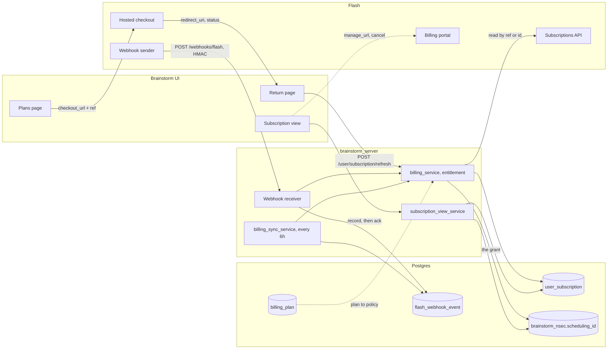
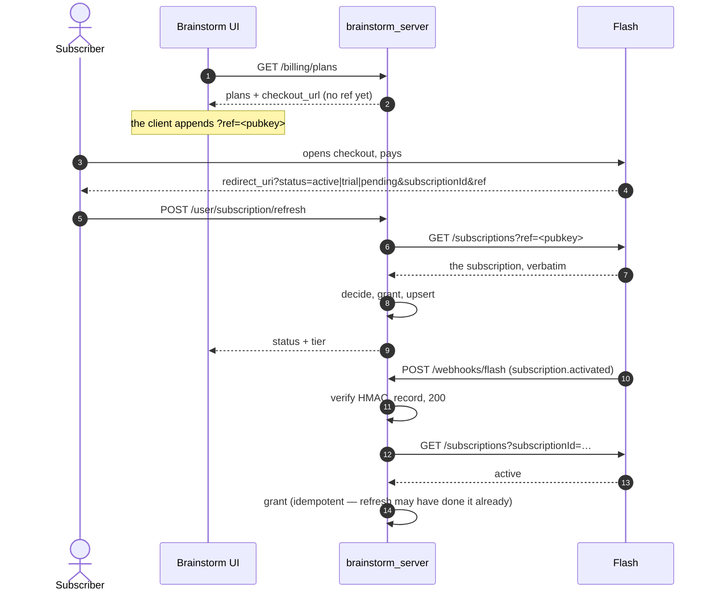
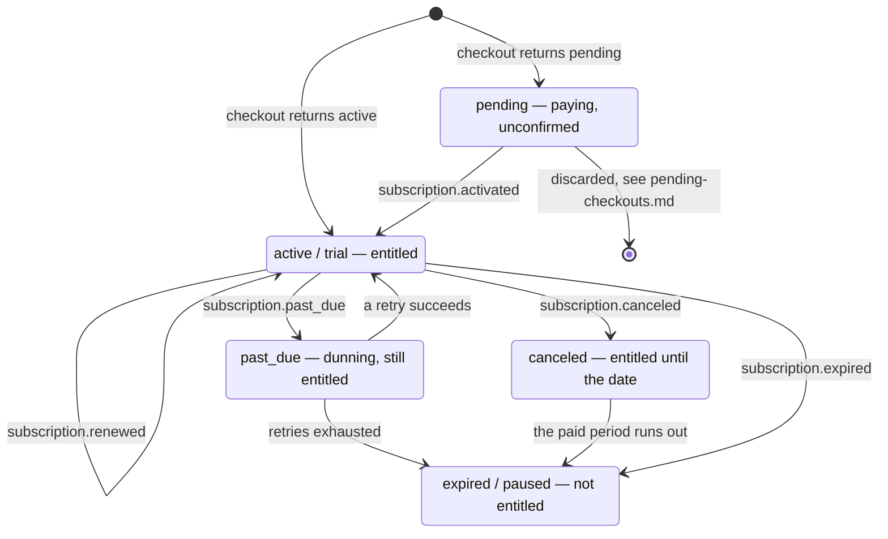

# The payment lifecycle, end to end

Every part that touches a payment, in the order it touches it. The one path that
goes nowhere — a checkout nobody finishes — is
[`pending-checkouts.md`](pending-checkouts.md).

## The pieces

Two things that diagram is trying to make obvious. **Entitlement is the write to
`brainstorm_nsec.scheduling_id`** — `user_subscription` only records why, and the
UI's `tier` is read back from the scheduling assignment rather than the billing
row, so it structurally cannot claim something the scheduler is not delivering.
And **every arrow into entitlement is followed by a read of Flash's API**: an
event says something changed, the API says what it now is.

## Signing up

The `ref` is the user's hex pubkey and it is the whole identity mechanism: Flash
echoes it in the redirect, in every webhook, and in the API response. That single
parameter is what removed an entire correlation subsystem — email matching, a
30-minute window, an admin queue for unmatched payments.

Checkout is idempotent on `ref`, so reopening the link never double-charges. The
same property means **testing a second signup needs a different `ref`**, which
for us means a different pubkey.

Both paths converge on the same function and both re-read Flash first, so
whichever arrives second finds the work already done rather than redoing it.

## Once live

`past_due` keeps the tier on purpose — the subscriber is inside Flash's dunning
and has not lost anything yet; the UI shows it as `grace`. `canceled` keeps it
until `cancelEffectiveDate` or the period end, because Flash words cancellation
in the past tense and a date is what defers it.

Anything Flash sends that we do not recognise **holds**: an unknown status can
neither grant a tier nor take one away. That asymmetry is deliberate, since their
status set is documented as open.

## When something is missed

Flash retries a failed delivery about three times and then never replays it, so
none of the above can be the only path. Every cycle, in this order:

| Step | What it repairs |
|---|---|
| `replay_unprocessed_events` | An event we recorded and acknowledged but died before processing. Recorded before the 200 precisely so this is possible |
| `revoke_lapsed_entitlements` | A paid period that ran out and whose `expired` never arrived. Pure DB, no Flash call |
| `reconcile_subscriptions` | Everything only Flash can settle: `past_due`, `pending`, still-`active` past its period end, renewing within the hour, or simply not read in a while |
| `prune_webhook_payloads` | Personal data in stored payloads, past the retention window |

Two kinds of row leave `reconcile_subscriptions` for good, because re-reading
them can only return the answer we already have: a checkout Flash discarded
(see [`pending-checkouts.md`](pending-checkouts.md)) and an **expired
subscription holding no policy**. Without the second, the sweep's "not read in a
while" clause re-reads every subscriber who ever churned, once per cycle,
forever — a cost that grows with the life of the deployment. `paused` and
`canceled` rows keep being read: a pause is reversible and a cancellation is
still on its way to expiring. Anyone who comes back arrives as an `activated`
webhook, which upserts the row outright rather than going through the sweep.

The lapse sweep deliberately **refuses to judge** a `past_due` row, or an
`active` one past its period end. Locally those are indistinguishable from
"renewal succeeded and we missed the event", and revoking on that ambiguity would
cut off someone who is paying. They go to the reconcile step, which asks Flash.

There is one hole this cannot close, and it is worth knowing rather than
discovering: the sweep reads `user_subscription`, so **a subscriber with no row
is asked about by nothing**. Someone who paid, whose webhook was lost, and who
never returned to the redirect page is invisible permanently — and Flash offers
no endpoint that lists subscriptions — it answers only `?ref=` or
`?subscriptionId=` — so nothing can enumerate them either.

## What can never happen

Rules that hold across every path above. Breaking one is a bug even where the
result looks right.

- **Nothing is granted from an event body.** Flash's own view is read first,
  which is also what makes concurrent handlers converge.
- **Uncertainty never costs a tier.** An unreachable Flash, an unrecognised
  status, an unmapped plan: all leave the policy alone.
- **The record and the grant commit together.** A tier without a record, or a
  record without the tier, is exactly what the divergence report exists to
  catch — so it should be impossible to create rather than merely detectable.
- **A delivery is recorded before it is acknowledged.** Once we answer 200 we own
  that event; a crash between the ack and a later commit would lose it for good.
- **Billing never erases an admin grant.** A comp survives a later lapse.
- **Only verified payloads are stored.** Writing unverified bodies would make a
  public endpoint an unauthenticated write primitive.

## Where to look when it is wrong

| Symptom | Look at |
|---|---|
| Paid but no tier | `flash_webhook_event` for their `externalRef`; then `failing_syncs` in `/admin/billing/divergence` |
| Tier but no payment | `policy_mismatch` and `admin_overrides` in the same report |
| "Confirming your payment" that never resolves | [`pending-checkouts.md`](pending-checkouts.md) |
| Never renewed | `flash_webhook_event` for a `subscription.renewed`; if absent, nothing was billed |
| An operator needs it fixed now | `POST /admin/billing/subscriptions/{pubkey}/resync` |
