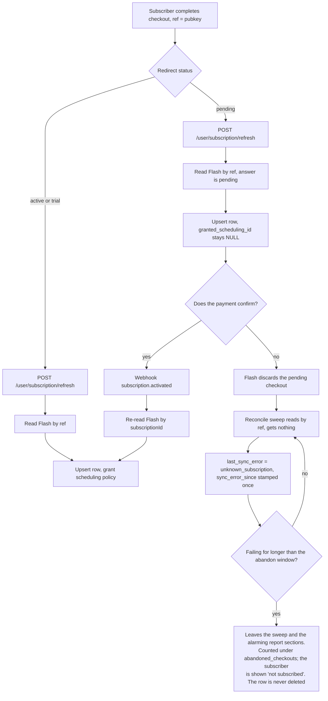
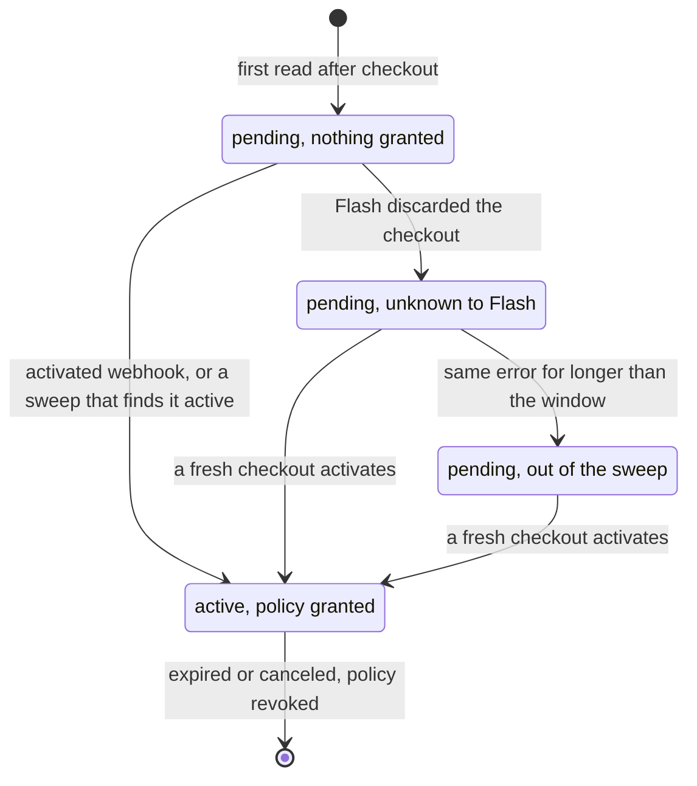

# Pending checkouts, and the ones nobody finishes

Why a subscription row exists before anyone has been granted anything, what happens to it when the
payment never confirms, and why the reconcile sweep eventually stops asking about it.

For the whole payment path this sits inside — signup, renewal, cancellation, and what repairs a missed
event — see [`lifecycle.md`](lifecycle.md).

Source of truth for Flash's own behaviour is the integration document Flash gave us, not
`docs.paywithflash.com` — that documents an older product and is actively misleading.

## What Flash does

A checkout redirects back with `status=active`, `trial` or `pending`. `pending` means the payment is real
but still being confirmed — some Lightning wallets or their relays answer slowly, so Flash keeps verifying
in the background. Flash's doc:

> Pending checkouts resolve within about 30 minutes: they either activate (you receive the webhook) or
> **are discarded** if the payment never confirms, after which the user can simply try again.

That discard is the thing to design around. A subscription we recorded as `pending` can simply cease to
exist on Flash's side, and every later lookup answers "no such subscription".

**The documented timing is not what staging does.** On 2026-08-26/27 a pending checkout was still
answering `pending` 14 hours after it was created, and had vanished 6 hours after that — against a
documented ~30 minutes and a ~10-minute invoice lifetime. Do not build a test around the 30 minutes.

## The flow

Two asymmetries worth noticing. The webhook path looks Flash up by `subscriptionId`, taken from the
recorded event; every other path — the refresh endpoint, the admin resync, the sweep — looks up by `ref`,
because a subscription id in a request body would be a claim to someone else's payment. And no path ever
grants from the event body: each one re-reads Flash's API first, so concurrent handlers converge.

## Why the row is written before anything is granted

It would be tempting to record nothing until `subscription.activated` arrives. Two things break if we do.

**A lost activation would be unrecoverable.** Flash retries a failed delivery a few times and then never
replays it. The reconcile sweep is the only path that recovers one, and it reads `user_subscription` — so
a subscriber with no row is invisible to it. They would have paid, lost the delivery, and silently never
been granted, until they happened to hit refresh themselves.

**The user would be told they had not paid.** `subscription_view_service` maps `pending` to a `pending`
UI status, and *no row at all* to `none` — "you have no subscription", shown to someone who just paid.
Flash's doc asks for a confirming state on `status=pending`.

So the row is the handle that makes both work, and its cost is that a checkout nobody completed leaves one
behind. That is a reason to stop *sweeping* it, never to stop *recording* it.

Not to be confused with an earlier design's pending-checkout records — email correlation, a 30-minute
matching window, an admin queue for unmatched payments. All of that was replaced by `ref`. This row is
just the ordinary subscription record carrying Flash's status verbatim.

## The row's life

`Abandoned` is not a status and not a deletion. It is one named condition — `AbandonRule` in
`user_subscription_repo` — negated by the sweep and asserted by the report. The row keeps its `pending`
status and its `unknown_subscription` error, stays in the admin subscriptions list, and simply stops
costing a Flash call every cycle. Nothing in the system deletes a `user_subscription` row.

Deliberately *not* a second value in `last_sync_error`. That column records what Flash said; "abandoned"
is an interpretation of what Flash said in the light of our own row, and storing an interpretation gives
you two fields that can disagree about one event.

## Where they show up

Not in `failing_syncs`, and not in `stale_syncs`. Both are bounded at 200 rows and neither is ordered, so
which rows come back is arbitrary once there are more than that — and abandoned checkouts are the one
failure that is both expected and unbounded in number. Left in, they would displace the credential error
or the lost paying subscriber those sections exist to surface, and all an operator would see is
`truncated: true`. `stale_syncs` is the worse of the two: dropping a row from the sweep freezes its
`last_synced_at` by design, so every abandoned row would age into "not read recently enough to trust"
within a day and stay there for good.

They get their own section instead, `abandoned_checkouts`, carrying pubkey, subscription id and
`sync_error_since`. Individually they are unremarkable. The count is the point: a spike is not a billing
fault but a broken checkout, and nothing else in the report would show it.

## Measuring "how long"

Giving up needs a clock, and none of the obvious columns is one:

| Column | Why it cannot answer "how long has this been failing" |
|---|---|
| `created_at` | When we first heard of the subscriber. A subscriber can sit legitimately `pending` for weeks, so row age would write them off on their first blip |
| `last_synced_at` | Stamped on every attempt, including the failures — a permanent failure looks permanently fresh |
| `updated_at` | Moves on every write, same problem |

Hence `user_subscription.sync_error_since` (migration `a1c4e7b02f19`): set when the current error first
appears, left alone while that same error repeats, cleared by a successful read. A *different* error
restarts it, because that is a different failure.

## The rule

A row drops out of `select_reconcile_candidates_on_db` only when all of these hold:

- `flash_status = 'pending'` and `granted_scheduling_id IS NULL` — nothing was ever granted, so nothing is
  at stake. A row that *did* grant and then goes unknown is a real anomaly; keep asking about it forever.
- `last_sync_error = 'unknown_subscription'` — Flash answered and had nothing. An outage or a credential
  failure raises rather than returning nothing, so those keep retrying.
- `sync_error_since` older than `billing_abandon_pending_after_seconds` (default 5h).

That window is deliberately **shorter** than `billing_sync_interval_seconds` (6h), and the margin is the
point rather than an accident of tuning. The window is a *minimum age* and the sweep can only act on
cycle boundaries, so at exactly one interval a row becomes eligible at the instant the cycle evaluating
it runs — decided by sub-millisecond ordering. On staging that race was lost and the row waited another
full six hours. At 5h against a 6h cycle the row has been eligible for an hour by the time anything
looks, so the first eligible cycle is deterministic. `test_the_abandon_window_is_shorter_than_the_sweep_that_applies_it`
holds the invariant.

So one failed read, not two: the sweep reads at t=0 and stamps the clock, and the row is already excluded
when the next cycle comes round at t=6h. That is enough, because the only thing the window guards against
is Flash answering 200 with an empty list for a subscription that really exists — every other failure
raises rather than returning nothing — and the discard it normally means is never undone.

The window is not free, and it is worth being exact about what it costs. The subscriber stops being shown
"confirming your payment" at `sync_error_since` + 5h precisely, because
[the view asks in Python at read time](#what-the-subscriber-sees) rather than waiting for a cycle. The
sweep exclusion lands separately, at the first cycle boundary after that. Two clocks, one rule.

Every path that could revive the subscriber bypasses this query entirely: an `activated` webhook upserts
the row outright, `POST /user/subscription/refresh` reads Flash on demand, and the admin resync endpoint
does the same. Giving up on the sweep does not close the door.

## What the subscriber sees

Once the row is abandoned, `read_subscription_view` presents it as **no billing record at all** — status
`none`, no period, no manage link — rather than as a payment being confirmed.

Without that, `_UI_STATUS` maps `pending` to `pending` unconditionally, so someone who abandoned a
checkout would be shown "confirming your payment" indefinitely, for a payment that will never confirm and
with nothing offering them a way to start again. It is the one place the stale row was visible to a user,
and the row exists for the sweep's benefit, not theirs.

This is the same `AbandonRule`, asked in Python via `matches()` instead of in SQL via `condition()`. The
two live next to each other deliberately, and an integration test runs both over the same rows, because
the failure mode is silent: a subscriber written off by one and still "confirming" to the other.

## Why we stop rather than keep checking

The tempting refinement is to back off rather than stop — re-read an abandoned row weekly instead of never
— on the grounds that the sweep is the only thing that recovers an `activated` Flash never delivered, so a
subscriber who came back and paid would otherwise be stranded.

That was built and then removed, because the argument does not survive contact with the API. **Flash has
no endpoint that lists subscriptions** — only `?ref=` and `?subscriptionId=` (see
only `?ref=` or `?subscriptionId=`). So a first-time subscriber who pays, whose webhook is lost,
and who never returns to the redirect page has no row, is asked about by nothing, and is invisible
permanently. That is the common case, and it is unfixable with the API as it stands.

Retrying abandoned rows weekly would insure a handful of subscribers against a failure we cannot insure
anyone else against — for a case that additionally requires the webhook to fail all three of Flash's
retries *and* the user to never land on the return page, which per Flash's own documentation always
follows a successful checkout. Consistency and simplicity both say stop.

If "someone paid and we never noticed" turns out to matter, the fix is a list endpoint from Flash and a
reconcile that runs in the other direction — not a special case for rows that happen to have a handle.
